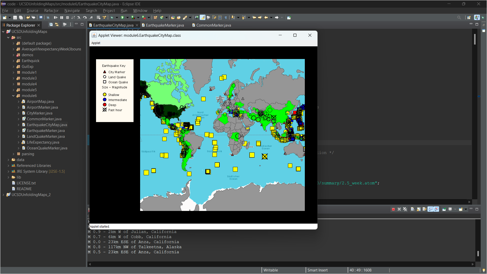

# Earthquake Country Coloring Extension

**Course:** Object Oriented Programming in Java - UC San Diego (Coursera)  
**Project:** Unfolding Maps - Earthquake Visualization Application  

## What This Extension Does
Colors countries on the map based on the number of earthquakes that occurred in them:
- **Darker color** = More earthquakes
- **Lighter color** = Fewer earthquakes  
- **Gray** = No earthquakes

## How It Works

### 1. Load Country Data (`setup()` method, lines 87-91)
```java
List<Feature> countries = GeoJSONReader.loadData(this, countryFile);
countryMarkers = MapUtils.createSimpleMarkers(countries);
```
Loads country boundaries from `countries.geo.json` file.

### 2. Count Earthquakes Per Country (`printQuakes()` method, lines 306-329)
```java
for (Marker country : countryMarkers) {
    String countryName = country.getStringProperty("name");
    int numQuakes = 0;
    for (Marker marker : quakeMarkers) {
        EarthquakeMarker eqMarker = (EarthquakeMarker)marker;
        if (eqMarker.isOnLand()) {
            if (countryName.equals(eqMarker.getStringProperty("country"))) {
                numQuakes++;  // Count earthquakes in this country
            }
        }
    }
}
```

### 3. Map Earthquake Count to Color
Uses `numQuakes` variable to determine country color darkness.

## Result
Interactive map showing earthquake distribution across countries with visual color intensity representing earthquake frequency.


